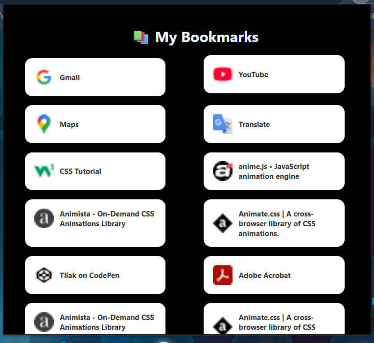

# cosmic-bookmarks
# 🚀 Galaxy Bookmarks Extension

A stunning, galaxy-themed Chrome extension that gives your bookmarks a stylish, tile-based visual interface. Say goodbye to cluttered bookmark bars—organize and explore your saved links in a vibrant, responsive layout.

## 🌌 Features

- 📚 Automatically fetches and displays all your Chrome bookmarks.
- 🧩 Beautiful galaxy UI with glowing tile design.
- ⚡ Fast and responsive interface using JavaScript and Grid layout.
- 🖼 Favicon preview for every bookmark.
- 🧑‍💻 Lightweight and open source.

## 🖼️ Preview



## 🛠️ Installation (Development Mode)

1. Clone or download this repository:
   ```bash
   git clone https://github.com/your-username/galaxy-bookmarks-extension.git
